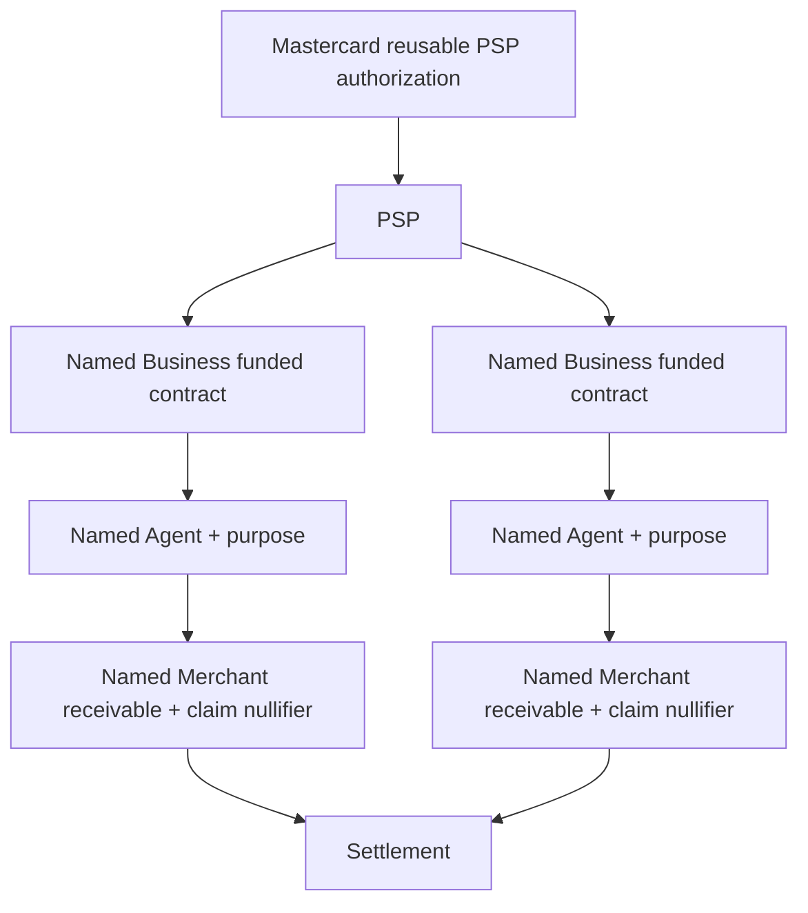

# ZK Chain WebApp Architecture

> Primary architecture document for the current funded-contract rewrite.

This app now demonstrates a privacy-preserving Mastercard → PSP → Business → Agent → Merchant system with interactive private validation, commitment-only admin views, named Businesses/Agents/Merchants, and Merchant-level settlement nullifiers.

For the full diagrams and detailed architecture, see:

- [`docs/ARCHITECTURE.md`](docs/ARCHITECTURE.md)
- [`docs/DECISIONS.md`](docs/DECISIONS.md)
- [`docs/SECURITY_MODEL.md`](docs/SECURITY_MODEL.md)
- [`docs/SETTLEMENT_MODEL.md`](docs/SETTLEMENT_MODEL.md)
- [`docs/QUANTUM_SAFE_MODEL.md`](docs/QUANTUM_SAFE_MODEL.md)

## Current model summary



## What changed from the old model

The old Groth16 allocation-chain prototype has been superseded by a funded-contract POC.

Current behavior:

- Demo user enters private amounts.
- Validations happen locally/private-style without showing actual values in admin views.
- PSP can fund up to two named Businesses.
- Businesses create named Agents with explicit purposes.
- Agents create named Merchant receivables.
- Nullifiers exist only at Merchant claim level.
- Admin portal shows commitments, statuses, purposes, parent links, event logs, and nullifiers — not raw amounts.

## Key files

```text
frontend/src/App.jsx                   Interactive demo + admin portal
contracts/MastercardProgramRegistry.sol
contracts/PSPBusinessFundedContract.sol
contracts/BusinessAgentAuthority.sol
contracts/MerchantReceivableRegistry.sol
contracts/SettlementNullifierRegistry.sol
simulation/simulate-flow.js
docs/ARCHITECTURE.md
README.md
Dockerfile
docker-compose.yml
```

## Run

```bash
npm run simulate
npm run build
docker compose up --build
```
