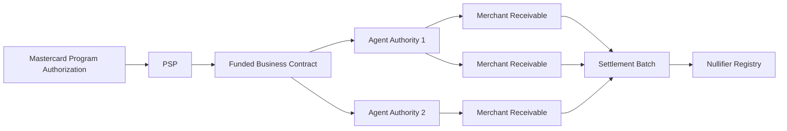

# Architecture

```mermaid
flowchart LR
  MC[Mastercard Program Authorization] --> PSP[PSP]
  PSP --> BIZ[Funded Business Contract]
  BIZ --> A1[Agent Authority 1]
  BIZ --> A2[Agent Authority 2]
  A1 --> M1[Merchant Receivable]
  A1 --> M2[Merchant Receivable]
  A2 --> M3[Merchant Receivable]
  M1 --> S[Settlement Batch]
  M2 --> S
  M3 --> S
  S --> N[Nullifier Registry]
```

The contracts store commitments, nullifiers, role relationships, status values, and timestamps. Amounts and business-sensitive limits remain off-chain.
