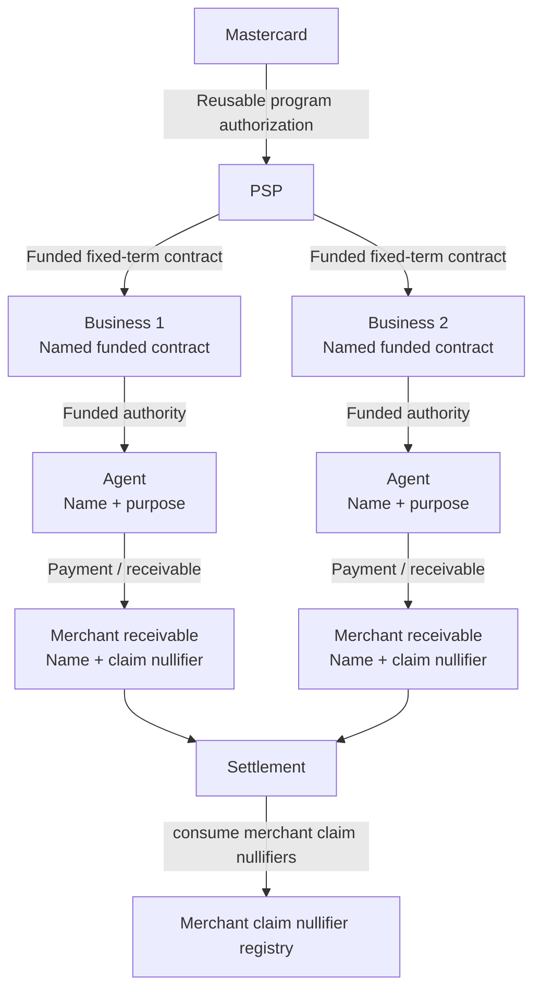
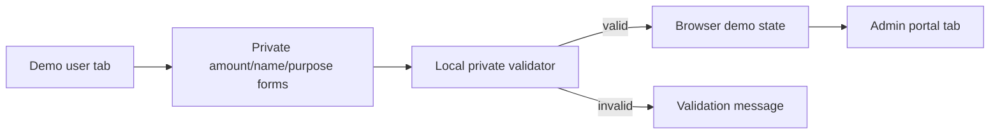
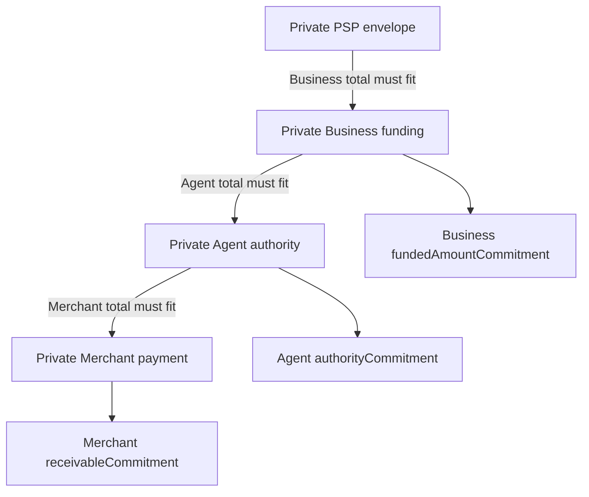
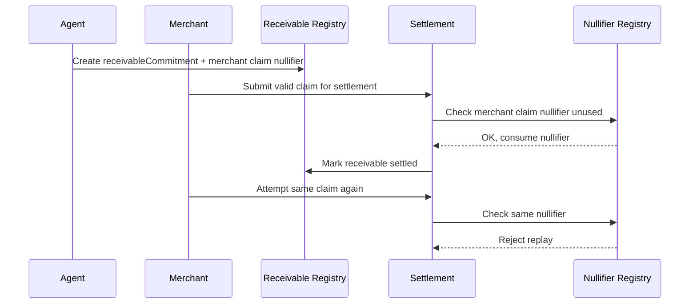
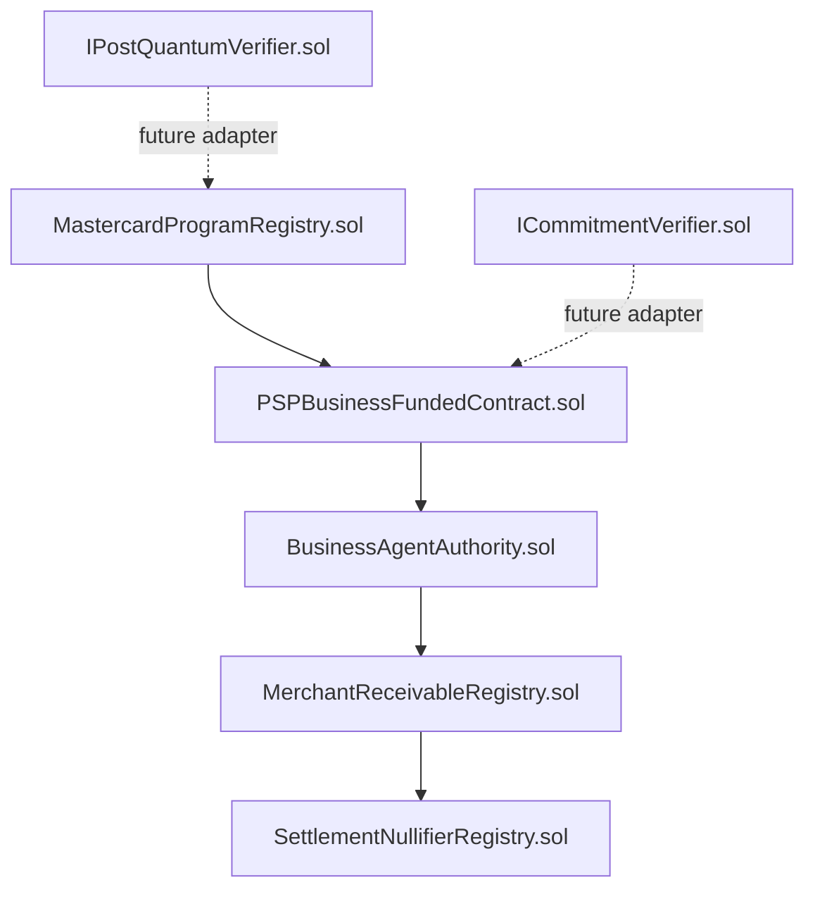
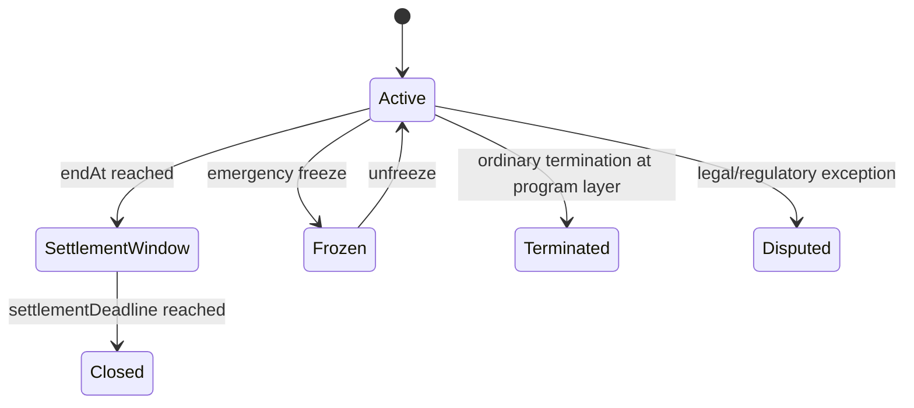

# ZK Chain WebApp Architecture

This document reflects the current rewrite: an interactive funded-contract and settlement POC for a Mastercard → PSP → Business → Agent → Merchant ecosystem.

The app is not a generic allocation chain. It models different relationship types at different layers and keeps monetary values private behind commitments.

---

## 1. Business model



### Mastercard → PSP

Reusable program authorization. It represents an approved PSP envelope/program, not a one-off transfer.

Controls:

- Ordinary termination: blocks new downstream Business contracts/extensions; existing valid claims may settle.
- Emergency freeze: pauses new downstream activity and can route activity to manual/dispute handling.

### PSP → Business

Named funded fixed-term contract. In the demo, PSP can create up to two Business contracts.

Rules:

- Business funding must validate privately against the PSP envelope.
- Contract stores commitment/public metadata, not raw amount.
- It is non-revocable during the committed period except emergency/legal/dispute paths.

### Business → Agent

Named Agent authority under a selected Business contract.

Rules:

- Agent has a name and explicit purpose.
- Total Agent authority under a Business must validate privately against that Business funded amount.
- Agent authority cannot outlive parent Business contract.

### Agent → Merchant

Merchant is a leaf claim/receivable, not a facility.

Rules:

- Agent pays a named Merchant.
- Receivable stores a commitment and Merchant claim nullifier.
- Total Merchant receivables under an Agent validate privately against that Agent authority.

---

## 2. Interactive frontend architecture



The demo intentionally uses local browser state for private values. That lets the UI demonstrate hidden validation while the admin portal only renders commitment-style public records.

### Demo user tab

The user can:

1. Create Mastercard → PSP authorization with a private envelope amount.
2. Create up to two named PSP-funded Businesses.
3. Create Agents under a selected Business with name, purpose, and private authority amount.
4. Create Merchant receivables under a selected Agent with Merchant name and private payment amount.
5. Settle Merchant claims.
6. Attempt replay/double settlement and see rejection.
7. Freeze/unfreeze or terminate the program.

### Admin portal tab

The admin portal shows:

- Contract IDs.
- Layer/name.
- Status.
- Agent purpose.
- Commitments.
- Parent-child links.
- Merchant receivable records.
- Merchant claim nullifiers.
- Settlement/replay events.

It never shows actual amounts.

---

## 3. Private validation model



Private validation rules:

- `sum(Business funded amounts) <= PSP authorized envelope`
- `sum(Agent authority amounts for Business) <= Business funded amount`
- `sum(Merchant receivables for Agent) <= Agent authority amount`

The demo stores private values only in session-local state for validation. Public/admin output is commitment-only.

---

## 4. Settlement architecture



Current rule: **nullifiers exist only at Merchant receivable claim level**.

Settlement batches contain:

- Batch ID.
- Rollup commitment.
- Claim references.
- Status/event metadata.

Settlement batches do **not** get their own nullifier in the current demo model.

---

## 5. Contract architecture



### Contracts

- `MastercardProgramRegistry.sol` — creates/terminates/freezes/unfreezes PSP program authorizations.
- `PSPBusinessFundedContract.sol` — creates named fixed-term funded Business contracts under a program.
- `BusinessAgentAuthority.sol` — creates named Agent authorities with terms/purpose hashes.
- `MerchantReceivableRegistry.sol` — creates and settles Merchant receivable claims.
- `SettlementNullifierRegistry.sol` — consumes Merchant claim nullifiers only.
- `IPostQuantumVerifier.sol` — placeholder adapter for future PQ signatures.
- `ICommitmentVerifier.sol` — placeholder adapter for future ZK/commitment proof verification.

No contract stores actual monetary amounts.

---

## 6. Lifecycle and time constraints



Rules:

- Child start must be greater than or equal to parent start.
- Child end must be less than or equal to parent end.
- Child settlement deadline must be less than or equal to parent settlement deadline.
- `settlementDeadline = endAt + 2 calendar days`.
- Active period allows downstream commitments.
- Settlement window allows existing claims to settle but blocks new commitments.

---

## 7. Docker/deployment architecture

```text
Dockerfile
  node:22-alpine build stage
    npm install frontend
    vite build
  nginx runtime stage
    serve frontend/dist
    expose docs under /docs

docker-compose.yml
  app          normal demo app on :8787
  simulation   optional Node simulation profile
  local-chain  optional local EVM profile
```

Run:

```bash
docker compose up --build
```

---

## 8. Quantum-safe posture

The app is **quantum-safe ready**, not fully quantum-safe on public EVM.

Why:

- Commitments and nullifiers are hash-first.
- Actual amounts are not public.
- PQ verifier interfaces are present for future off-chain/admin instruction verification.
- Standard public EVM account signatures are still elliptic-curve based, so complete end-to-end PQ safety is not claimed.
