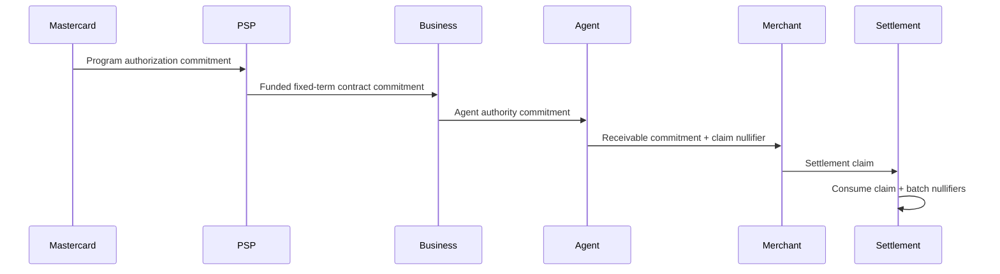
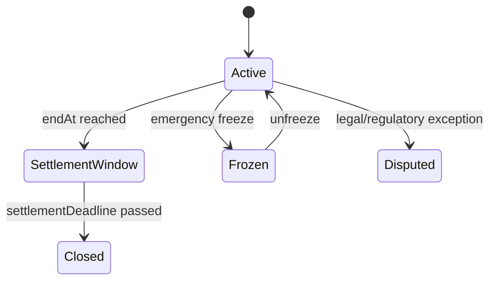

# Flow Diagrams

## End-to-end

```mermaid
sequenceDiagram
  participant MC as Mastercard
  participant PSP
  participant B as Business
  participant A as Agent
  participant M as Merchant
  participant S as Settlement
  MC->>PSP: Program authorization commitment
  PSP->>B: Funded fixed-term contract commitment
  B->>A: Agent authority commitment
  A->>M: Receivable commitment + claim nullifier
  M->>S: Settlement claim
  S->>S: Consume claim + batch nullifiers
```

## Lifecycle

```mermaid
stateDiagram-v2
  [*] --> Active
  Active --> SettlementWindow: endAt reached
  SettlementWindow --> Closed: settlementDeadline passed
  Active --> Frozen: emergency freeze
  Frozen --> Active: unfreeze
  Active --> Disputed: legal/regulatory exception
```
